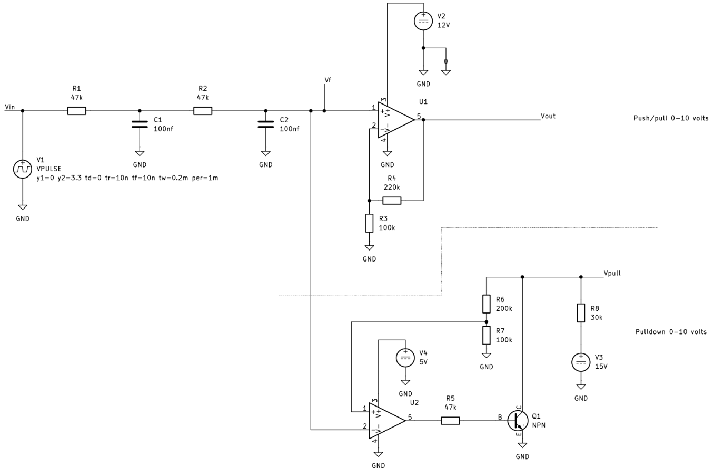

# Wireless 0-10 volt light dimmer

## Background

Some LED lights use a separate 0-10 volt DC signal to control their brightness. This project
eliminates running separate low voltage wire for this purpose. The original use case was a finished
garage where fluorescent tubes were replaced with UFO-style hanging LED fixtures. Fishing a hundred
feet of new wire behind drywall was not a serious option.

## Overview

The user chooses a dimming level via an EC11 rotary encoder driving an ESP32 that serves as an
ESP-now broadcast transmitter. Any number of other ESP32s configured as receiver convert the dimming
level to a PWM output that's low-pass filtered and voltage multiplied to 0-10 volts. Multiple
transmitters also work as you'd want them to.

This design does _not_ handle on/off by interrupting mains power. A separate switch is necessary for
that. These units are meant to be switched along with the lights. Non-volatile storage is used to
restore previous state.

Commercial products performing a similar function but lacking the multiple transmitters feature cost
about $80 for a transmitter/receiver pair and $53 for each additional receiver.

## Useful details

Transmitters and receivers run the same firmware. A GPIO pin (see wifi.c for number) strapped to
ground makes the device a receiver, else it's a transmitter.

Pressing the rotary encoder's shaft pushbutton-style forces a broadcast in case any receiver falls
out of sync. Twisting it changes the dimming level.

For all nodes, the on-board LED flashes and then pauses continuously. The number of flashes, zero to
eight, reflects current dimming level, min to max.

### Security

Since ESP-now doesn't provide security, we need our own. The main threats are spoofing and playback.
To counter, broadcast payloads include a sequence number and SHA-256 signature based on payload data
concatenated with a secret key. Receivers check the signature and verify that sequence numbers are
ascending. All nodes checkpoint sequence numbers to NV storage and re-load them while rebooting.

### Transmitter parts

- ESP32-WROOM dev board. Prototype used [this basic ESP-32](https://www.amazon.com/dp/B0F1MS5S8R).
  Capabilities used:
  - 4 GPIO pins. See `dimmer.c` to re-configure.
  - On-board LED as level indicator.
  - Wifi ESP-now broadcast and receive.
  - Non-volatile storage for wifi and app state including level and payload sequence numbers.
- Lines voltage to 5v or 3.3v power source for ESP32. 500ma minimum.
- EC11 rotary encoder

### Receiver parts

- ESP32-WROOM dev board. See transmitter Capabilities used:
  - 2 GPIO pins. See `dimmer.c` to re-configure.
  - On-board LED as level indicator.
  - Wifi ESP-now receive.
  - Non-volatile storage for wifi, persisting level and security info through power losses.
- Lines voltage to 12v power source
- 12v to 3.3v DC down converter for ESP32. 200ma minimum.
- 3 x 20k resistor
- 1 x 10k resistor
- 2 x 100nf capacitor
- LM358P op amp

### Receiver output circuit

The receiver output consists of a filter that transforms PWM output to an analog voltage level
between 0 and 3.3 volts. Following this is an op-amp stage that multiplies this by 3 to provide the
necessary 0-10 volt dimming signal. There are two variations of the output.

The simplest option is a non-inverting circuit with the op amp powered by 12vdc. LM358P can safely
source 20ma and sink 10ma, which is likely to be enough. If more current is needed, use a higher
capacity part like OPA1656. A discrete pass transistor after the op amp is another possibility.

Another option is available if the controller being driven needs its input only to be "pulled
together" from a pre-existing potential differential of 10 or more volts toward zero. My controller
works this way. Its 0-10 volt input behaves like a 15 volt source in series with a 30k resistor.
Short circuit (0 volt) current is 0.5ma. By using a discrete pass transistor to do the pulling, the
op amp can do with a 5 volt supply, which can be shared with the ESP32.

This schematic shows the filter connected to both kinds of op amp output. Since the LM358 is a dual
device, both can be wired on the same board at little extra cost.

